<!-- _class: lower-heading -->

# I15-1 (XPDF)
Dean Keeble
DLS/ISIS Crystallography Meeting
January 2026

---

## I15-1 Beamline Staff

|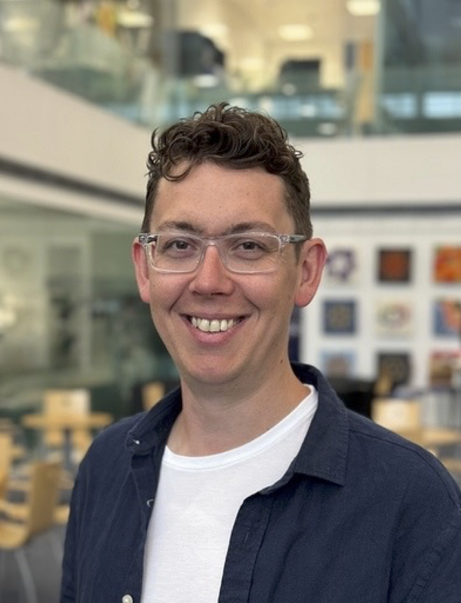 |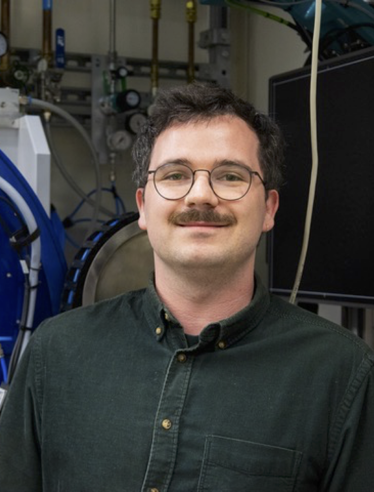 |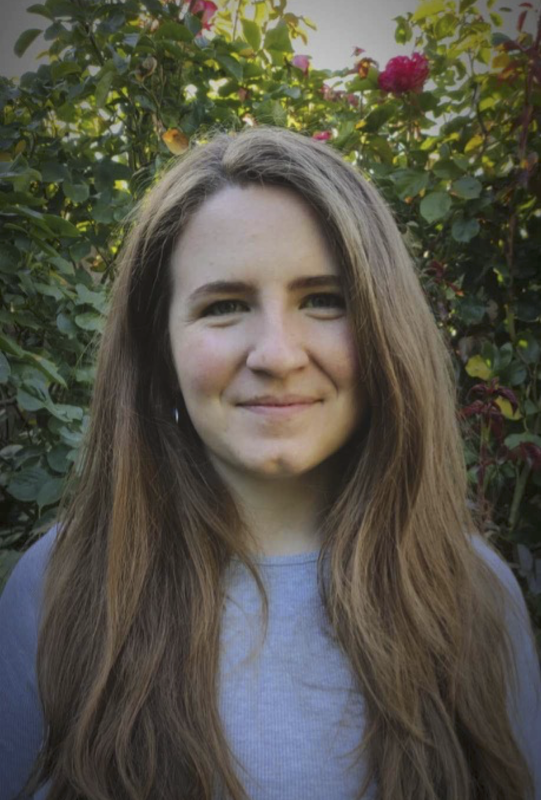 |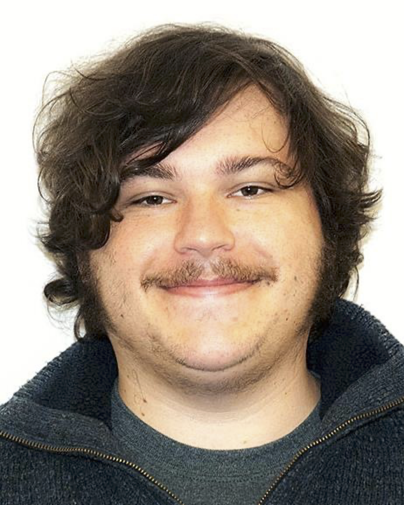 | 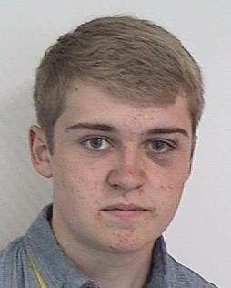
:-----:|:------:|:-----:|:------:|:------:
Dean Keeble | Dan Irving | Anna Herlihy | Tobias Bird | Finley Belcher

---

## What is I15-1?
- I15-1 is a high-energy, high-flux, powder diffractometer
- Primarily designed for total scattering and PDF studies
- Built to use an unused side portion of the I15 source profile

&nbsp; &nbsp; &nbsp; &nbsp; &nbsp; &nbsp; &nbsp; &nbsp;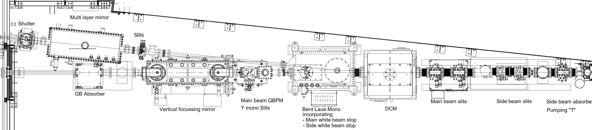

---

### High Energy
We have 3 fixed energies, 40 keV, 65 keV, and 76 keV. At 76 keV: 
- can access a Q of ~28 Å-1
- 89% transmission through 10 mm of aluminium
### High Flux
We bend our monochromator crystal to increase the bandwidth (at the cost of reciprocal space resolution)

---

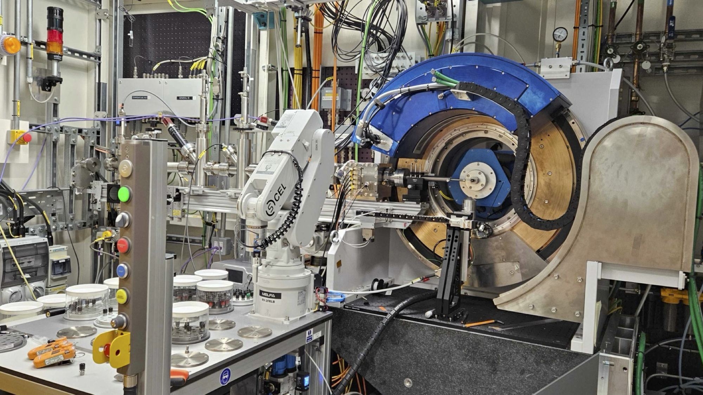
### Typical Experiments
- Samples in glass capillaries
- 440 positions on the table
- Hot (1050 K) and cold (90 K)
readily available
- Expose sample for ~10 minutes
- Everything pretty scriptable
&nbsp;

---

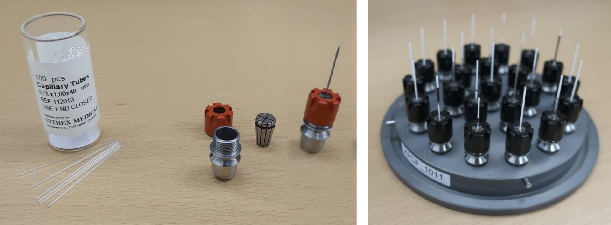

---

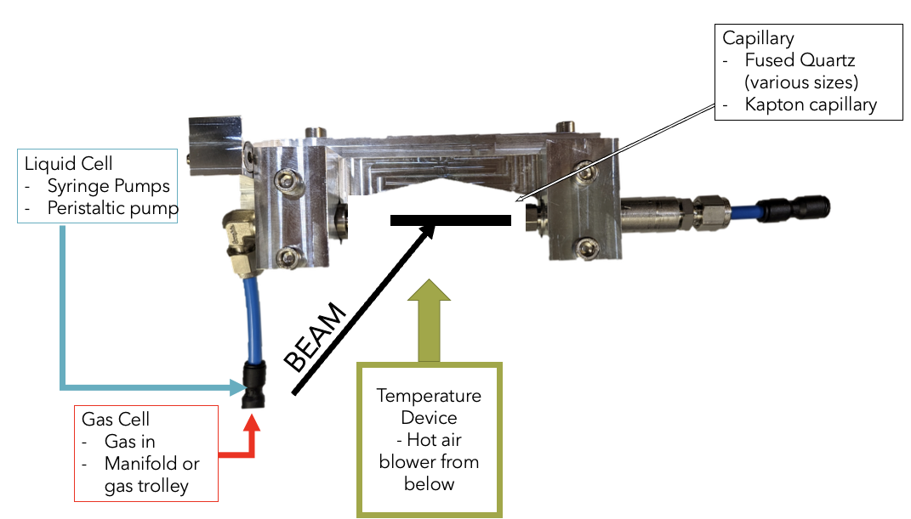

---

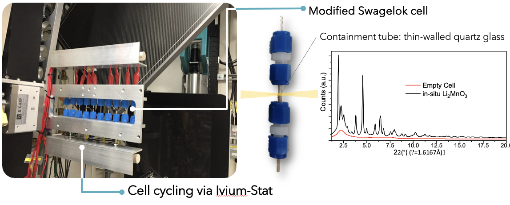
<!-- _footer: Diaz-Lopez, et al. (2020)  J. Synchrotron Rad. 27, 1190.
 -->

---

&nbsp; &nbsp;&nbsp;&nbsp;&nbsp; 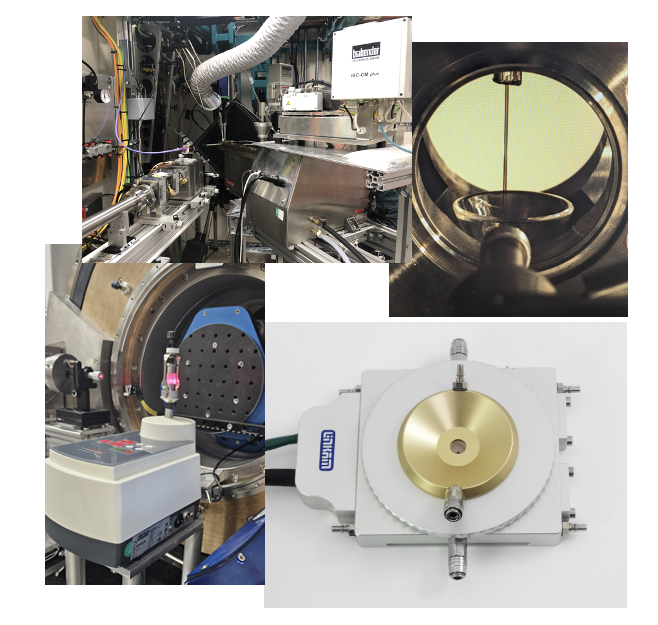 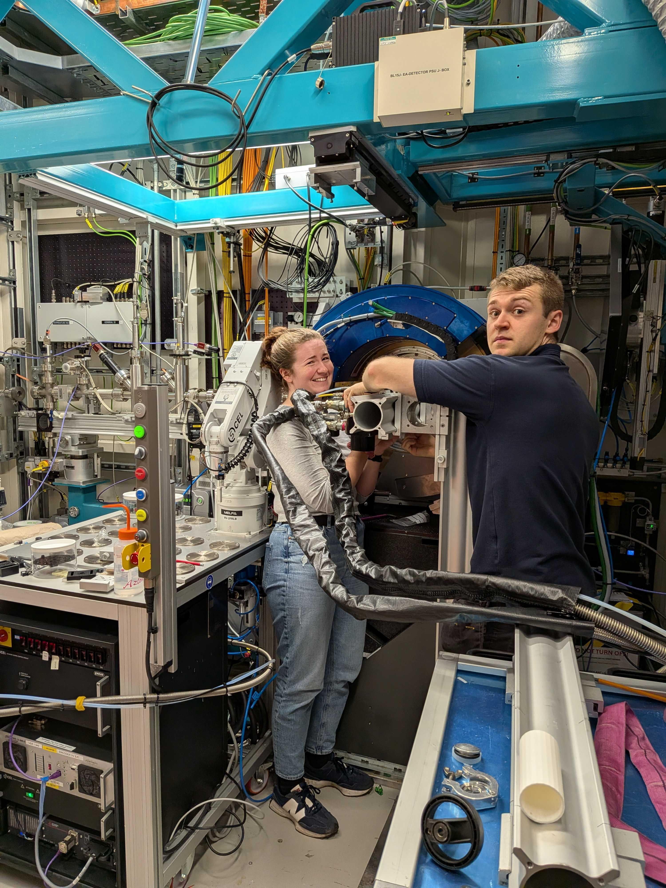

---
### Previous/Current DLS/ISIS collaborations
- Previously we offered "free" room temperature data collections to the ISIS Crystallography group
- More recently we've had a lot of DM proposers include I15-1 on their proposals, and we're looking to widen this collaboration

---

<!-- _class: lower-heading -->

## Future Plans
#### New & newer Detectors, Diamond-II
---

## New Detector(s)

 &nbsp;| model | sensor  thickness | pixel size | frame rate |  coverage
:-----:|:------|:-----|:------|:------|:---
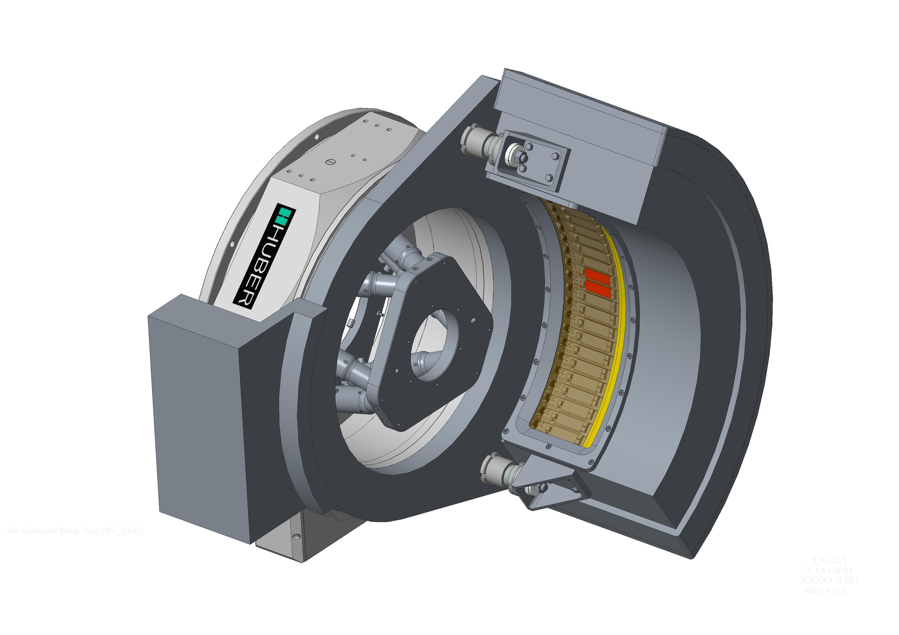| ARC CdTe| 1 mm | 75 um | 25 Hz | 109°
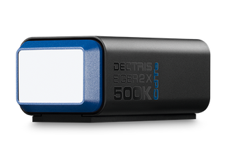 | Eiger 2X CdTe | 750 um | 55 um | 2.2 kHz | 17°

---

## Diamond-II 

- The Diamond-II upgrade will see a new software stack deployed at Diamond
- In 2026 I15-1 will start using this new stack
- Looking to introduce better interconnectivity of data and bespoke web interfaces

---
<!-- _class: lower-heading -->

# I15-1 (XPDF)
Dean Keeble
DLS/ISIS Crystallography Meeting
January 2026